# IOTBHEALTHREPORT
## Executive Summary 
### This Analysis of the Health care database covers 54,966 patients records and examins revenue, admissions, medical conditions, tests and medication to identify operations and  finacial trends. 
 Revenue and Billing analysis: The hospital genrated a total billing amount of #1.4B. Revenue is stable every months, peaking in July at #122.5M and the lowest in Febuary at #109.9M.
### Admission Analysis: 54,966 patients with balanced split across Elective, Urgent, and Emergecy. August had the highest admissions at 4,785. Females had slightly more emergency admissions than males. Peak admission month is August with 4,785 patients while Febuary had the lowest at 4,210 patients and for emergency admissions, Females account for 9,166 cases compared to 8,936 for males. 
### Patient Analysis: Gender is nearly equal. 50.03% male and 49,.97% Female.
### Medical condition analysis: Arthritis affects the most patients at 9,218, followed closely by Diabetes, Hypertension,Obesity, Cancer amd Asthma. Diabetes drives the highest billing by condition at 236.5M, despite not having the highest patient count. 
### Test Result Analysis: Test results are evenly distributed Abnormal 18,437, Normal 18,331, inconclusive 18,198. Blood group distribution is uniform with A- the most common at 6,898 patients.
### Medication Analysis: Ibuprofen is the most prescribed medication at 11,023 prescriptions and the highest billing medication at 283.8M 
## Key Findings/Observations 
### Revenue & Billing Analysis: Revenue is stable with no extreme rise. Total billing is 1.4Billion. Highest rise is in july at #122.5M, lowest in Febuary at #109.9M. Difference is only #12.7M across months 

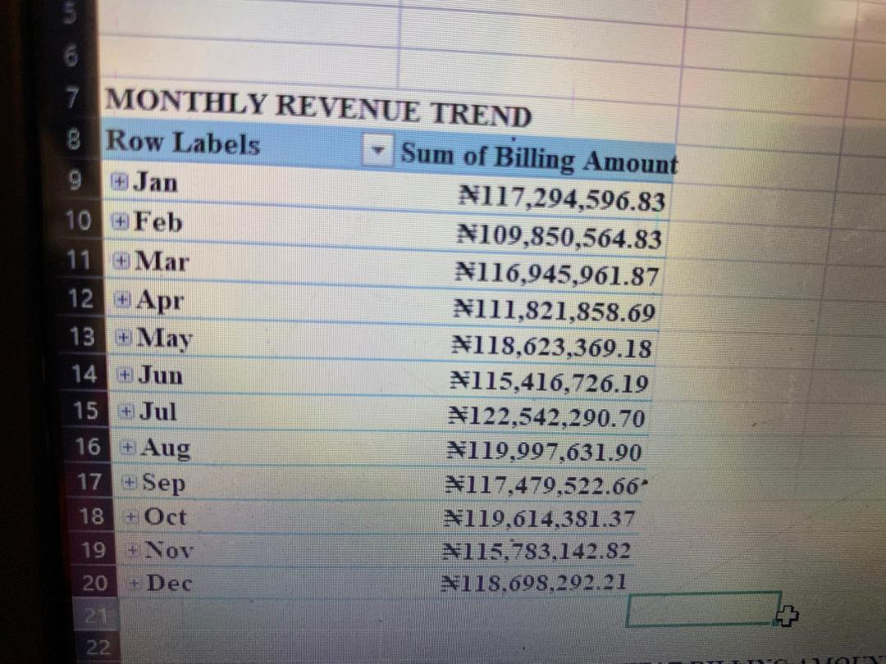

Insurance revenue is evenly spread. Cigna leads at #284.3M, Aetna lowest is at #276.5. The diffenece betwween hughest and the lowest is #7.8M
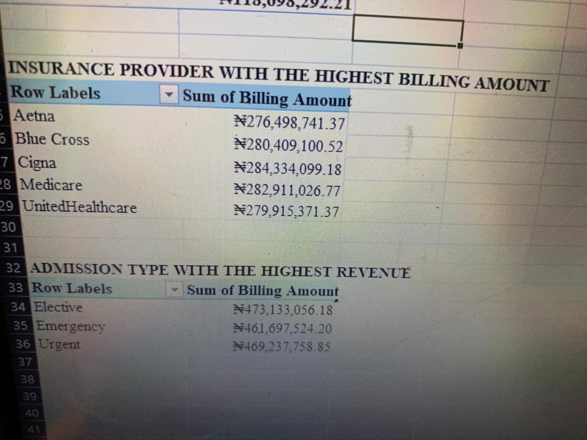

### Admission Analysis: Elective admission drives the most revenue. Elective had #473.1M, Urgent had #469.2M, Emergency had #461.7M. Planned procedures which is the elective admission generate higher billin that urgent and emergency admissions

Emergency admission analysis: Females recorded the highest number of emergency admission at 9,166 while male had  8,936. the admisssion is nearly equal.

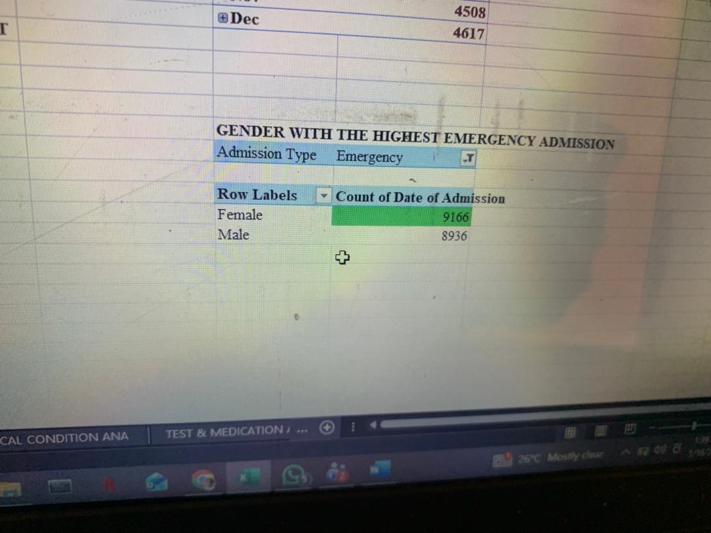

Monthly admission trends: August recorede the highest admissions at 4,785, while febuary was the lowest at 4,210. Admissions remained stables throughout the year, and increased a little bit during the middle of the year months.
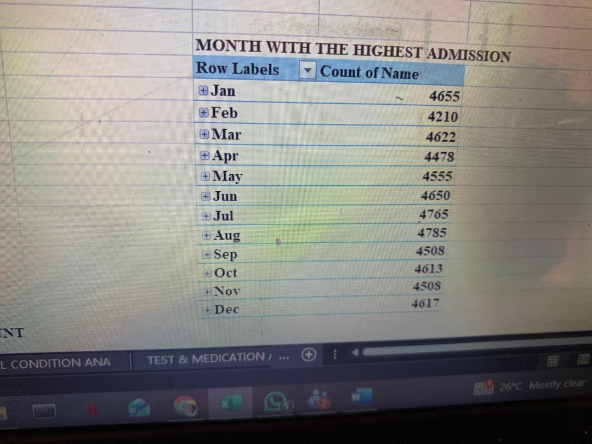
### Patients Analysis: Total patients are didvided by gendesr, male had 27,496 patients while female recorded 27,470 patients
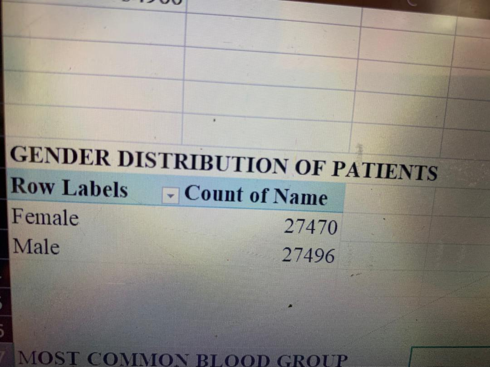
Blood group distribution: A- had the most common blood group with 6,898 patients while O- has the lowest with 6,804 patients
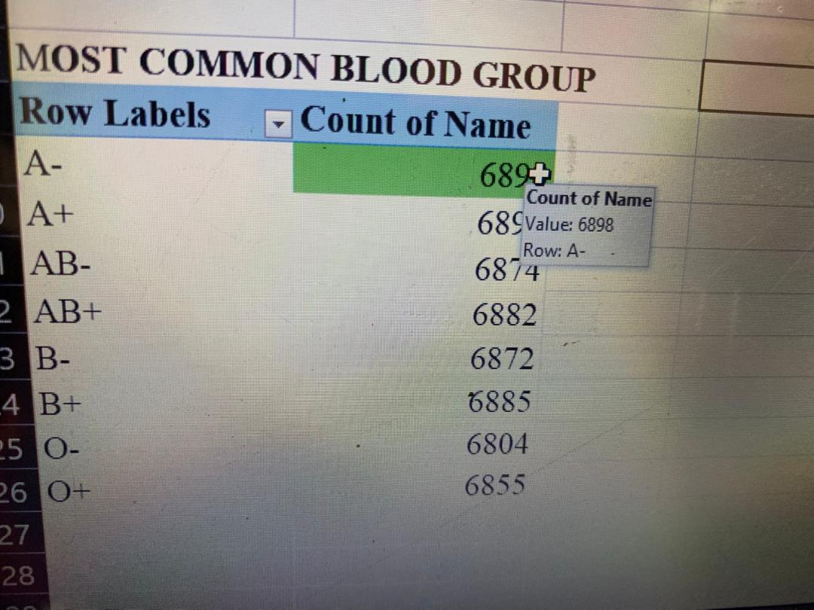
Age group analysis: Seniors and Adult had over 75% of the admission while children and adult makes less than 3% commbined. this means that the hospital sees more elderly and young adult compared to children and adults. Seniors recorded the highest patients with over 20,948 patients while adult had the lowest which is 798 patients.
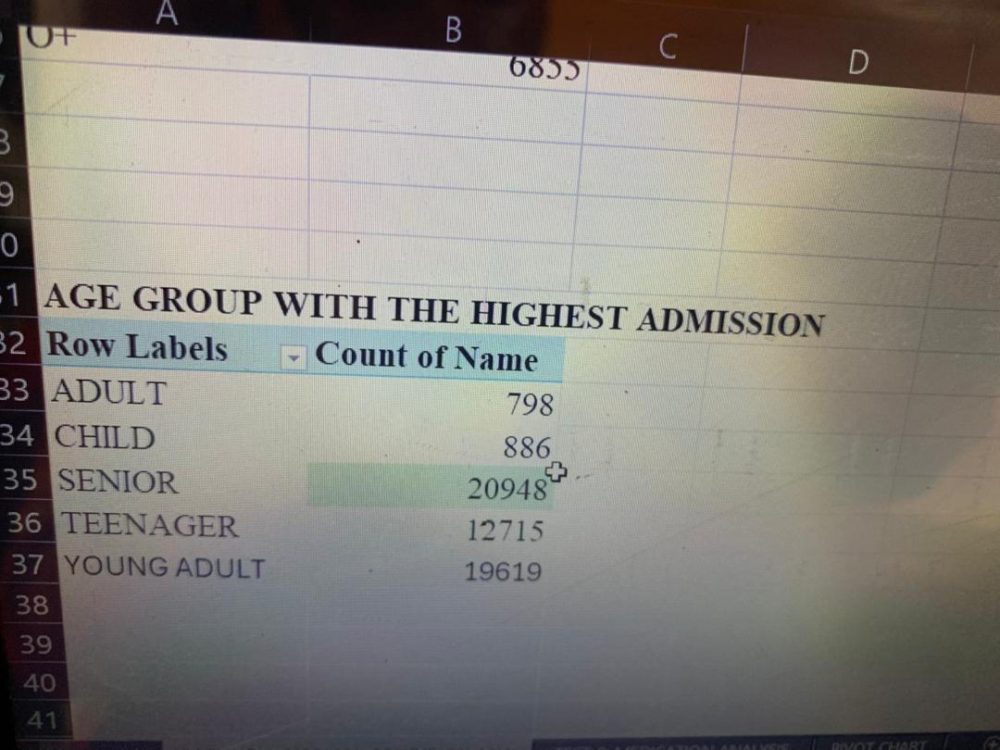

### Medical Conditions: Arthritis affects 9,218 patients, Diabetes, Hypertension,Obesity,Cancer and Asthma follows
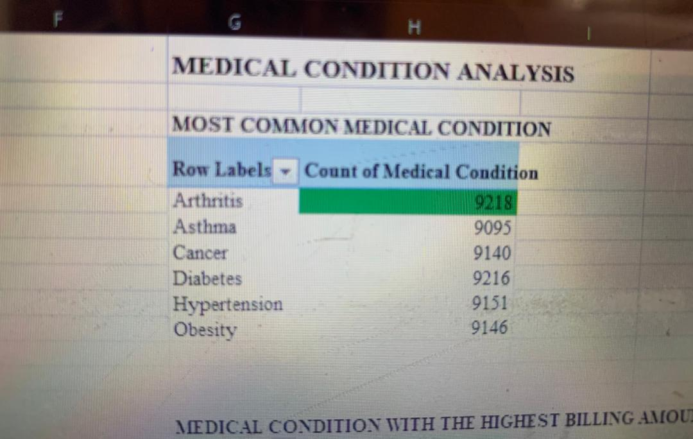
Billing analysis by medical condition
Diabetes had the highest total billing amount at #236.49Million, followed by obesity and Arthritis. All the conditions generates more revenue, indicating that chronic illnesses generate more money for the hospital.
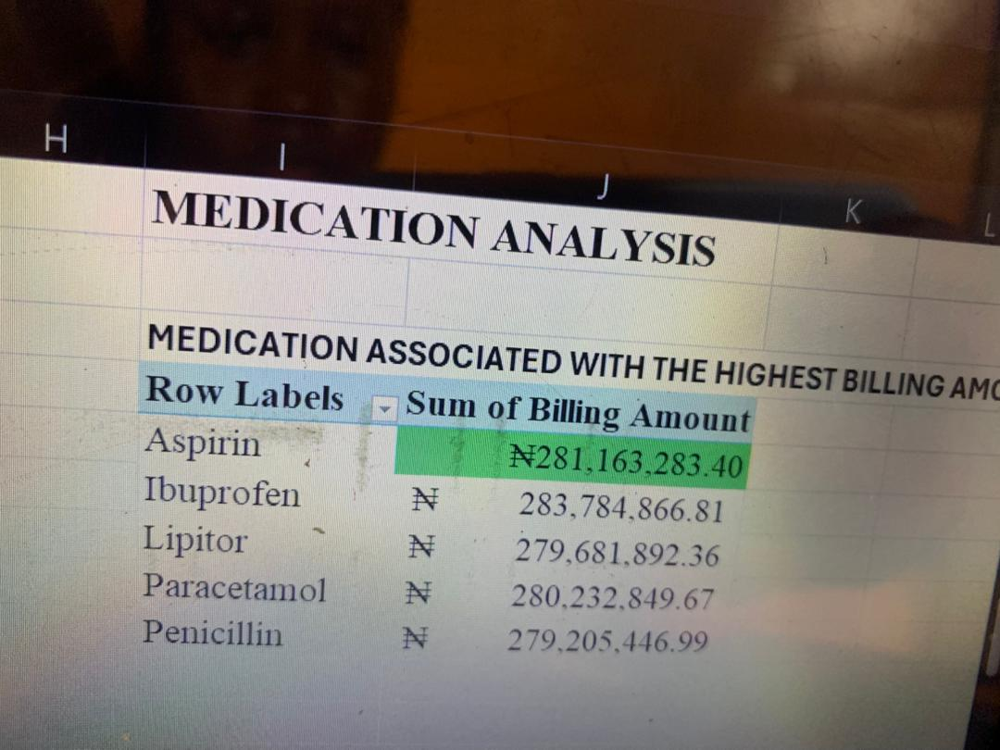
Medical condition Frequency: All the conditions had patients and they generated revenue, the only difference betwwen the highest and the lowest is just 123 difference, this shows that the hospital have botj chronic and non chronic conditions
### Test Result Analysis: The result are splited. Abnormal are only 106 more than the normal result. Out of all the test analysed, 18,437 were abnormal, 18,331 was normal and 18,198 was inconclusive.
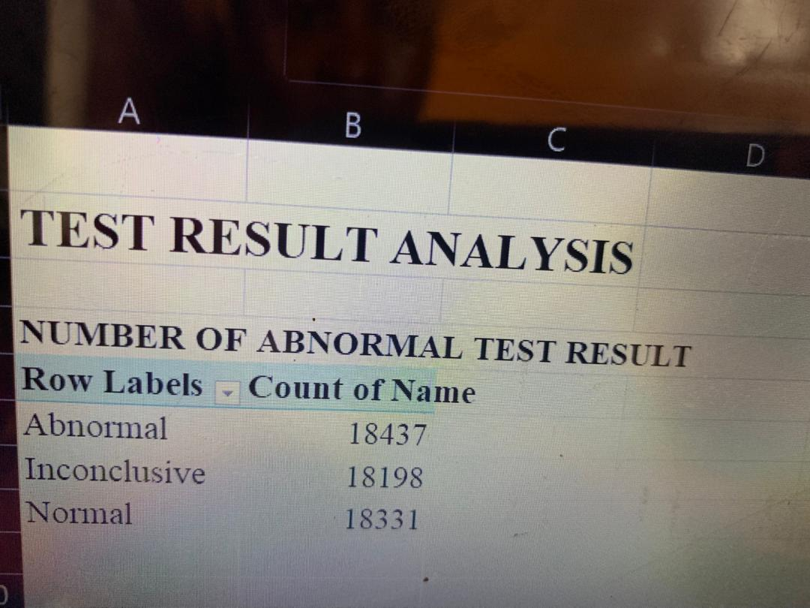
Condition associated with the abnormal test result 
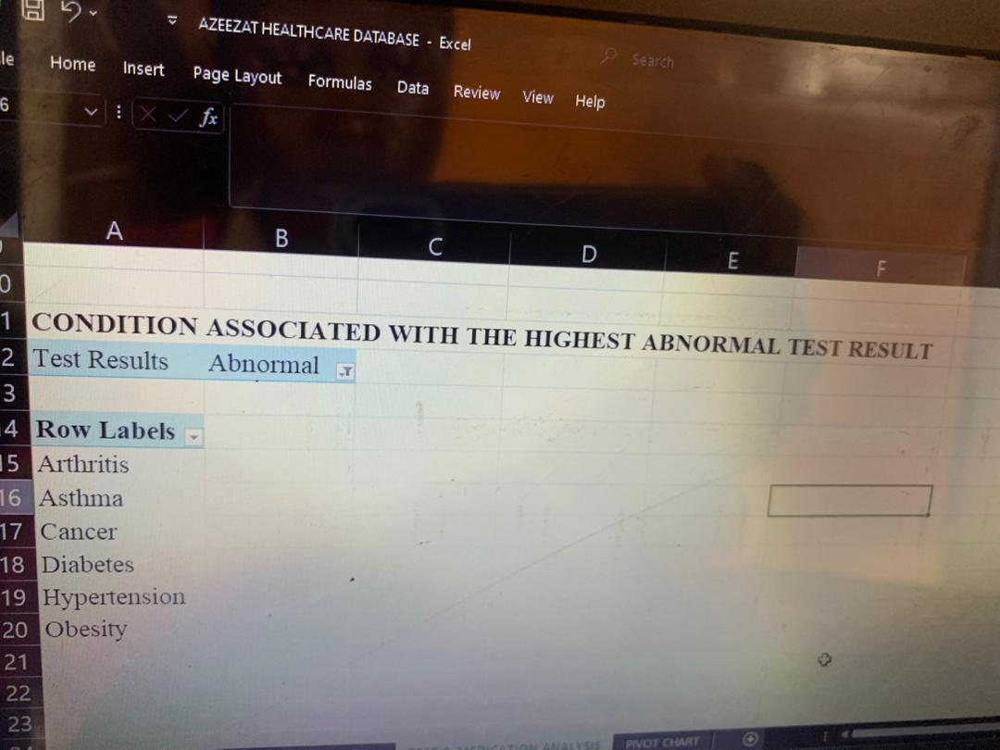
### Medication Analysis: Lipitor is the most prescribed medication with 11,038 prescriptions, but the counts are very close across all 5 drugs. The range between the highest and the lowest medication is only 82 prescriptions. This shows that the hospital treats a mix of condition among the patients, there is no single patient that goes without a prescription.
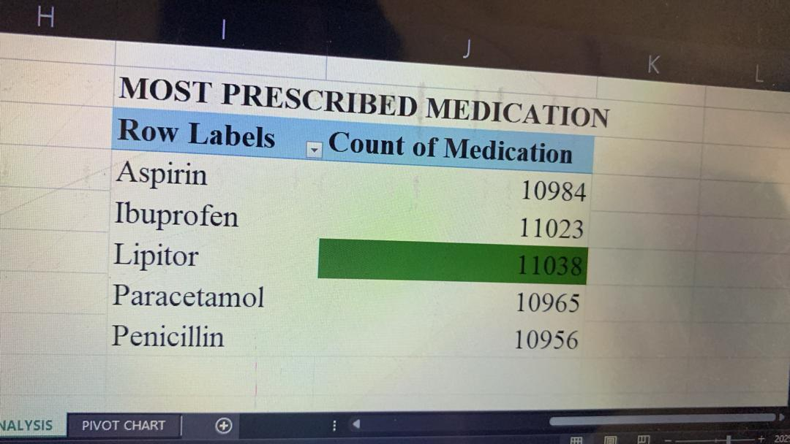
Medication Billing Analysis: Ibuprofen generated the highest billing with #283.7Million, although all medication had almost he same billing with just few difference, the difference between the highest and the lowest is just #4.58M, this means that all medication contributed greatly to the revenue.
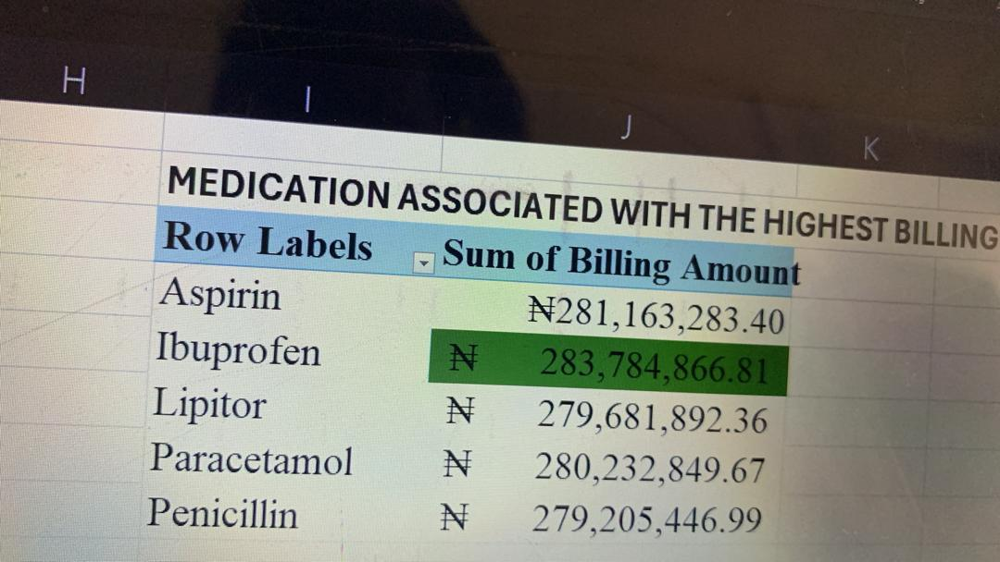
## Insight
The data is almost balanced, the test result, drugs and the billings are close to the same.
Too many test are inconclusive, which means a lot of patients need to do the test again.
The hospital treats alot of conditions and they didnt depend on any medication or revenue. 

## Recommendation
They should focus on working on the number of inconclusive, check the testing process and train the staff on how to work on the testwithout affecting the balanced medication use and revenue they already have.
